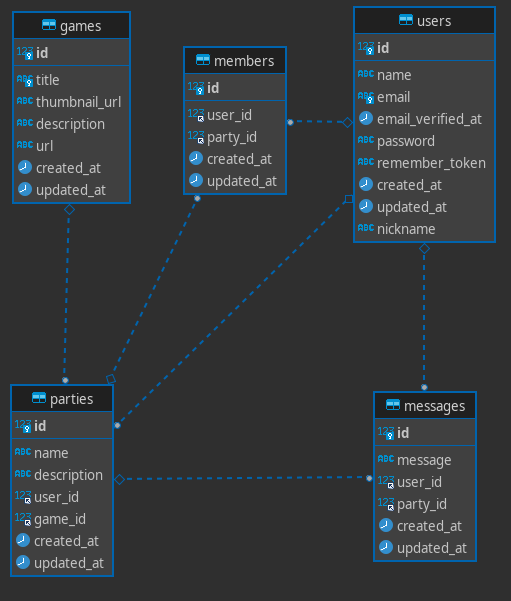

# Gaming Chat with PHP

<div align="center">


</div>

This is a REST API of a gaming LFG platform, using mysql as data base. Having tables for `games`, `members` and `messages`, `parties`, `users`.

<div align="center">

[](https://github.com/luigiMinardi/GamingChatPHP/wiki)
</div>

## Installing

* First clone the repository:

    ```bash
    git clone https://github.com/luigiMinardi/GamingChatPHP
    ```

    Enter in the cloned repo `cd GamingChatPHP` or open in your IDE, for example `code GamingChatPHP` if you're using VSC.

* Install all the dependencies:

    ```bash
    composer install
    ```

* Create the data base:

    <u>**You need to have mysql installed and running on your computer for this to work**</u>. You need to create the db directly on mysql (or your GUI manager for SQL dbs).

* Make the migrations:

    ```bash
    php artisan migrate
    ```

* Run the server:

    ```bash
    php artisan serve
    ```

### Configuring .env
In your root repository duplicate the `.env.example` file and rename it to be just `.env`, there you need to eddit these variables with your data:
```m
APP_KEY=

DB_DATABASE=laravel
DB_USERNAME=root
DB_PASSWORD=
```

Run `php artisan jwt:secret` to create the `JWT_SECRET` variable at your `.env`.

Now you are ready to use it.

# Using the API

## Data Base ER Diagram



### Expected Behaviour

`created_at`, `update_at`, `id`, are obligatory and auto-generated.

the `id` is the **Primary Key** of the tables.

USER `email` is unique.

GAME `title` is unique.

`user_id`, `game_id` and `party_id` are the USER, GAME and the PARTY **Foreign Key** respectively.

You may see references for the **Primary Key** as `pk` and for the **foreign key** as `fk`.

## Endpoints

To see the endpoints and how they works, check our [documentation](https://github.com/luigiMinardi/GamingChatPHP/wiki).

<div align="center">

[](https://github.com/luigiMinardi/GamingChatPHP/wiki)
</div>